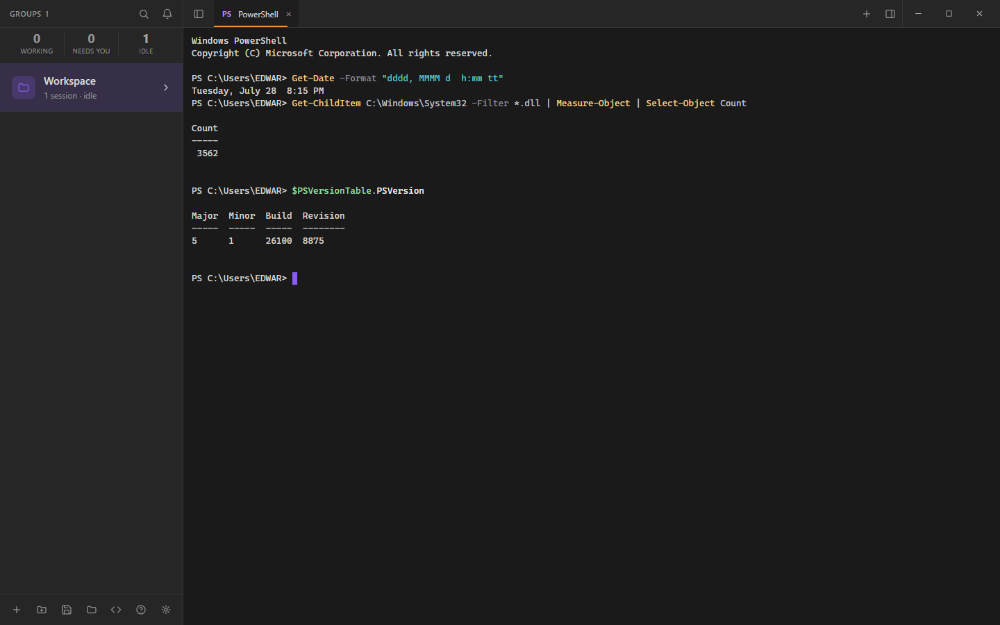
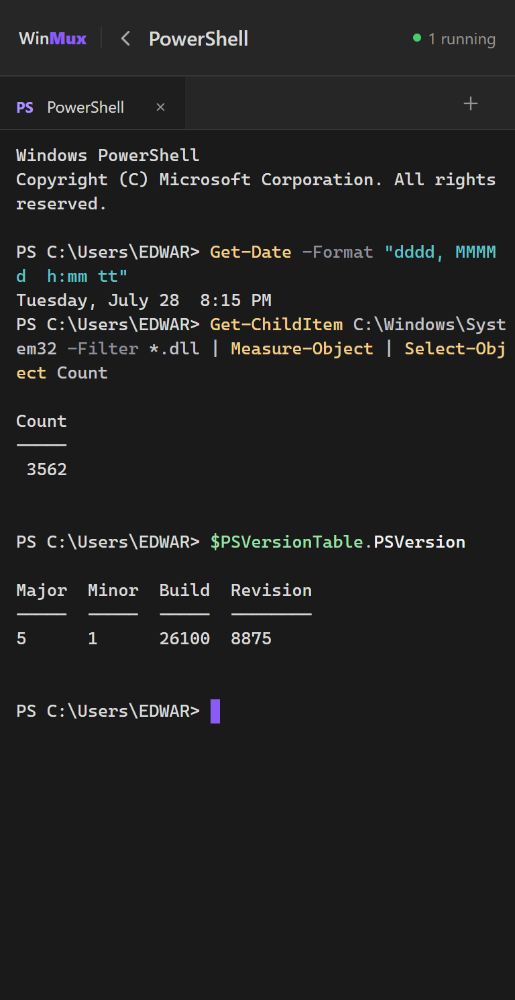
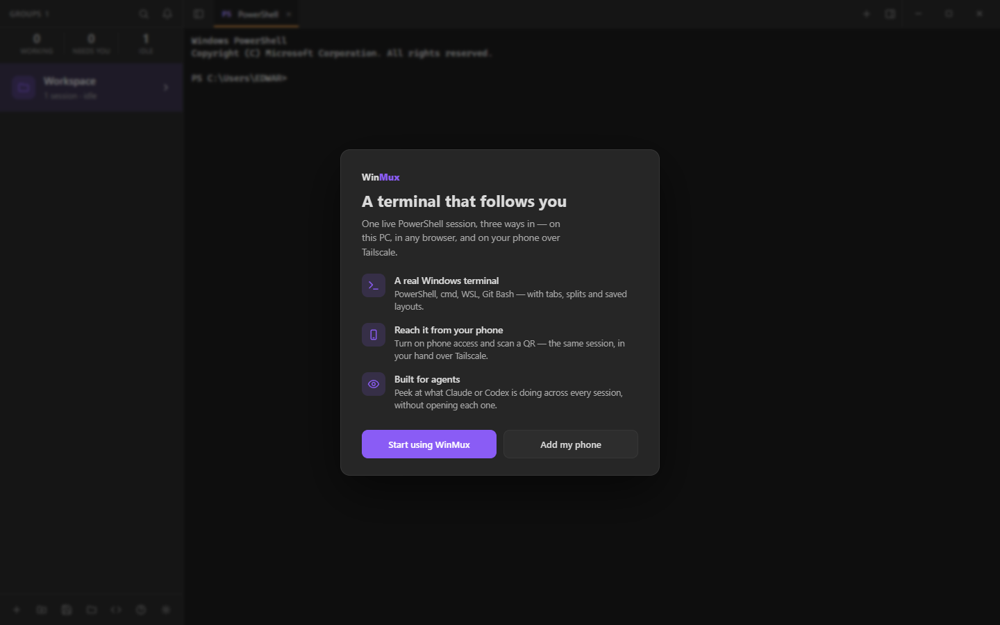
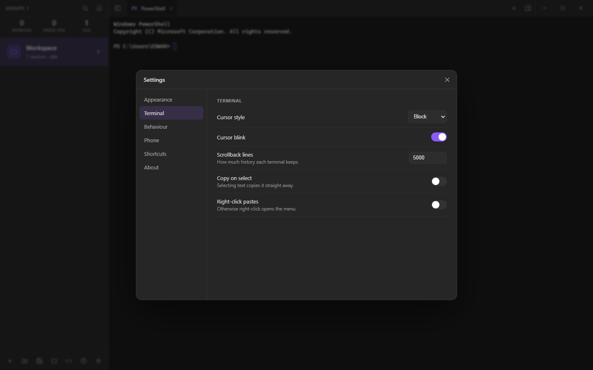

<div align="center">

# WinMux

**A terminal that follows you.** One live PowerShell session — reach it on this PC, in any browser, or from your phone over Tailscale.

[](LICENSE)




</div>

WinMux is a terminal multiplexer for Windows built on **one** Node server (`server.cjs` — node-pty + ws)
that spawns real PowerShell / CMD / Git Bash / WSL shells and streams them to an [xterm.js](https://xtermjs.org/)
cockpit. That single server has **three faces**, and all of them are clients of the same in-process
session — so what you start at your desk is the exact terminal you pick up on your phone.

- **Desktop app** — a native, frameless Windows window (Electron).
- **Browser** — open the served URL on this PC.
- **Phone** — reach the same shells over [Tailscale](https://tailscale.com/), gated by a per-link access key.

<div align="center">

### ⬇️ [Download WinMux for Windows](https://github.com/Zbrooklyn/winmux/releases/latest)

Grab **`WinMux Setup <version>.exe`** from the latest release, run it, and launch WinMux from the Start menu.
No Node, no build step. *(The installer is unsigned, so Windows SmartScreen shows an "unknown publisher"
notice on first run — click **More info → Run anyway**.)*

</div>

---

## Why WinMux

- **Real Windows shells, not an emulator.** PowerShell, cmd, WSL, and Git Bash, each in tabs and splits, with saved layouts.
- **The same session everywhere.** Start a build at your desk, watch it finish from your phone on the couch — one server, many windows.
- **No open ports to the internet.** Phone access rides your private Tailscale network; a device gets in only after it scans the QR once, and you can forget any device later.
- **Scriptable by agents.** A `winmux` CLI drives the live app over a local RPC surface — open tabs, run commands, read the screen, drive a browser panel. Built so Claude (or any agent) can operate a terminal for you.
- **See which session needs you — and clear it in one tap.** When a background terminal rings for attention it turns "needs you" in the sidebar; peek at what it's asking, then **Approve** (Enter) or **Deny** (Esc) right from the fleet view — on desktop or your phone — without switching into it.
- **Survives the network.** Shells outlive a dropped socket; the client reconnects instead of printing `[session ended]`.

## The three faces

|  |  |
|---|---|
|  | **On your phone.** The same PowerShell session, over Tailscale, sized for a thumb. The brand bar shows what's running; tap back to the session list, tap a session to open it. A per-link key controls who gets in. |

## First run

Open WinMux for the first time and it introduces itself once — what it is, the three ways in, and a one-tap jump to set up phone access. It never gets in your way again.

<div align="center">

</div>

## Requirements

- **Windows 10 or 11**
- **Node.js ≥ 18** (node-pty ships prebuilt N-API binaries, so no native build step is required)
- **Tailscale** — only if you want phone access; the desktop and browser faces work without it

## Install & run

### Option A — Download the installer (recommended)

1. Open the [latest release](https://github.com/Zbrooklyn/winmux/releases/latest) and download **`WinMux Setup <version>.exe`**.
2. Run it. Windows SmartScreen may warn ("unknown publisher", because the build is unsigned) — click **More info → Run anyway**.
3. Launch **WinMux** from the Start menu. It installs per-user (no admin needed) and creates Start-menu and desktop shortcuts.

### Option B — Run from source (Electron)

```powershell
npm install
npm run dev:electron
```

This opens WinMux in a frameless native window. The same server keeps serving your phone over Tailscale — the desktop app and the phone are two clients of one server.

> **Building your own installer:** `npm run dist` compiles and packages a fresh `WinMux Setup <version>.exe` (NSIS) into the off-repo output folder printed at the end. See [PLAN.md](PLAN.md) for the release checklist.

### As a plain server (browser + phone)

```powershell
npm install
npm start
```

Then open the printed `http://127.0.0.1:<port>` in a browser.

### Reach it from your phone

1. In WinMux, open **Settings → Phone** and turn on phone access.
2. Scan the QR (or open the printed Tailscale link) on a phone that's on your tailnet.
3. That device is remembered after the first scan. Forget any device later from the same panel — forgetting rotates the key so an old link stops working.

<div align="center">

</div>

## Drive it from the command line

With WinMux running, the `winmux` command scripts the live app:

```powershell
winmux status                    # the running server + fleet (sessions, phone)
winmux list                      # the open terminals
winmux new-tab                   # open a tab in the active pane
winmux split down                # split the active pane
winmux send "Get-Date" --enter   # type into the active terminal and run it
winmux read-screen --lines 40    # read what's on screen
winmux browser open example.com  # open the browser panel (desktop app)
winmux browser snapshot          # list the page's clickable elements as @refs
winmux browser click @e1         # click one of them
winmux markdown README.md        # open a file in the live markdown viewer
winmux open workspace.json       # open a saved set of terminals (cwd/shell/command each)
```

An agent (e.g. Claude) uses these to open terminals and run tools for you. The browser panel is
the desktop app's Electron `<webview>`; the markdown viewer follows a file live as it's written.
The CLI works only at the PC (`127.0.0.1`), never over the phone link.

## Verify

```powershell
npm run verify
```

A zero-argument Playwright harness (`verify.cjs`) that starts its own servers, drives the real
cockpit, and asserts **measured** behaviour — computed styles, box metrics, real terminal output —
across the desktop, phone, dark, and light surfaces. It includes an offscreen Electron smoke check
that boots the native shell and confirms a real command runs through node-pty end-to-end.
Screenshots land in `verify-out/`.

## How it's laid out

| Path | What it is |
|---|---|
| `server.cjs` | The one server: node-pty shells + ws + the HTTP/RPC surface. Boots in-process under Electron **and** runs standalone as `node server.cjs`. |
| `public/` | The cockpit — vanilla JS (`app.js`), `index.html`, and the frozen `cockpit.css` design contract. |
| `electron/` | The desktop shell (`main.ts`, `preload.ts`), compiled to `dist-electron/`. |
| `bin/winmux.cjs` | The CLI over the local RPC surface. |
| `verify.cjs` | The committed verification harness. |
| `PLAN.md` / `DESIGN.md` / `PRODUCT.md` | Roadmap, design system, product definition. |

## Contributing

Issues and pull requests are welcome. Before opening a PR, run `npm run verify` and keep it green —
the harness is the contract. Please don't edit `public/cockpit.css` directly; it's the frozen design
contract, and new styling belongs in the `index.html` override layer.

## License

[MIT](LICENSE) © Zbrooklyn
